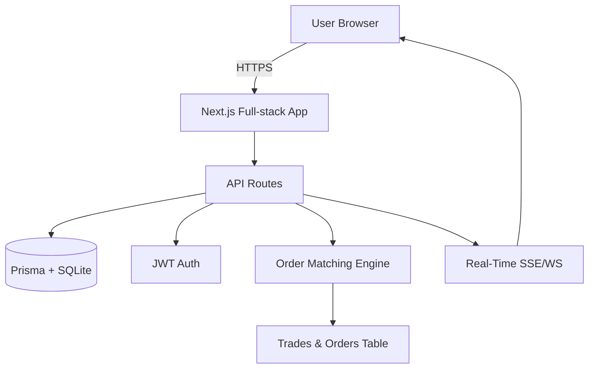

```markdown
# QuantumTrades (Next.js Full‑Stack)


A beginner-friendly, production-minded **real-time trading demo** built with **Next.js (App Router)**, **TypeScript**, **Prisma + SQLite**, **JWT auth (httpOnly cookie)**, and **SSE live updates**. Fully responsive across desktop, tablet, and mobile.

> Extract and run immediately — no external DB or complex config required.

---

## ✨ Features
- User registration, login, logout (hashed passwords, JWT in httpOnly cookie)
- Role support (trader / admin placeholder)
- Place **limit / market** BUY/SELL orders
- Simple price‑time **matching engine**
- **Order book**, **live trades**, **my orders**
- **SSE** stream for real-time updates
- SQLite via Prisma (file-based DB)
- Responsive Tailwind UI
- API routes (App Router)
- Vitest tests for core engine
- Production build passes `npm run build`

---

## 🗂 Folder Structure

```

quantumtrades-nextjs/
├─ app/              # Next.js App Router pages & API endpoints
├─ components/       # Reusable UI components
├─ lib/              # Prisma client, auth utils, pubsub, matching engine
├─ prisma/           # Prisma schema + SQLite db
├─ tests/            # Vitest tests
├─ public/           # Optional assets
├─ .env              # Environment variables
├─ docker-compose.yml # Optional Docker setup
├─ README.md         # This file

````

---

## 🛠 Tech Stack

| Layer         | Technology / Tool        | Notes |
|---------------|------------------------|-------|
| Framework     | Next.js 14 App Router   | Full-stack React framework |
| Language      | TypeScript             | Strong typing |
| DB / ORM      | SQLite + Prisma        | File-based demo DB, Prisma ORM |
| Auth          | JWT (httpOnly cookie)  | Secure token-based authentication |
| Passwords     | bcryptjs               | Hashing for security |
| State Updates | SSE (Server Sent Events)| Real-time order updates |
| Styling       | Tailwind CSS           | Utility-first responsive design |
| Testing       | Vitest                 | Unit tests & coverage |
| Deployment    | Vercel / Netlify / Docker | Supports full-stack Next.js apps |

---

## 🚀 Quick Start (Local)

1. **Clone the repo**

```bash
git clone https://github.com/kishan-kumar-dev/quantumtrades.git
cd quantumtrades
````

2. **Install dependencies**

```bash
npm install
```

3. **Set environment variables**

Create a `.env` file in the root:

```
DATABASE_URL="file:./dev.db"           # SQLite file for development
JWT_SECRET="supersecurerandomstring123" # Change in production
NEXT_TELEMETRY_DISABLED="1"            # Optional: disables Next.js telemetry
```

4. **Generate Prisma client & build**

```bash
npx prisma generate
npm run build
```

5. **Start development server**

```bash
npx prisma migrate deploy || true   # creates DB if absent
npm run dev
```

6. **Open app in browser**

[http://localhost:3000](http://localhost:3000) → Register → Dashboard → Place orders.

---

## 🐳 Docker Setup (Optional)

1. Build and start services:

```bash
docker-compose up --build
```

2. Visit [http://localhost:3000](http://localhost:3000) to use the app.

---

## 🧪 Testing

Run tests:

```bash
npm test
```

Run with coverage:

```bash
npm test -- --coverage
```

Coverage summary appears in terminal.

---

## 📖 API Endpoints Overview

| Method | Endpoint          | Description                    |
| ------ | ----------------- | ------------------------------ |
| POST   | /api/register     | Register new user              |
| POST   | /api/login        | Login user                     |
| POST   | /api/logout       | Logout user                    |
| GET    | /api/me           | Get logged-in user info        |
| GET    | /api/orders       | Get open orders + my orders    |
| POST   | /api/orders       | Place new order (limit/market) |
| DELETE | /api/orders?id=ID | Cancel order                   |
| GET    | /api/trades       | Get recent trades              |
| GET    | /api/stream       | SSE for live updates           |

---

## 🔒 Security Notes

* JWT stored in httpOnly cookie to prevent XSS leaks
* Inputs validated via Zod
* Passwords hashed with bcrypt
* HTTPS required in production

---

## 🌱 Demo Seed User

Run:

```bash
npm run seed
```

Creates demo account:

* Email: **[demo@quantumtrades.com](mailto:demo@quantumtrades.com)**
* Password: **password123**

---

## 📊 Architecture Diagram



---

## 🧩 Troubleshooting

* Delete `./prisma/dev.db` to reset database
* If Prisma client is missing: `npm run build`
* For production DB: edit `prisma/schema.prisma` and run migrations
* Ensure Node.js >= 18 installed
* For Docker, ensure ports `5432` and `3000` are free

---

## 🤝 Contributing

1. Fork the repo
2. Create a new branch `feature/xyz`
3. Make changes and commit
4. Open a Pull Request

---

## 📄 License

MIT License

---

## 📬 Author

* Name: Kishan Kumar
* GitHub: [kishan-kumar-dev](https://github.com/kishan-kumar-dev)

```
